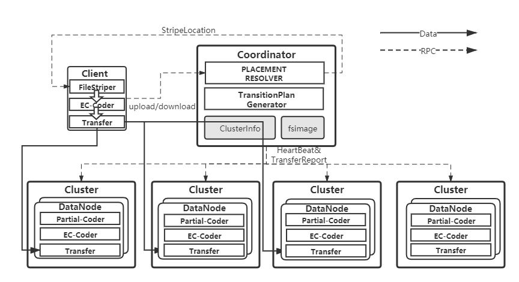

# Overview

This repository is created for "Optimal Data Placement for Stripe Merging in Locally Repairable Codes" , including the simulation and system implementation(./simulation and ./prototype directory). Our contribution is to propose a merging-style redundancy transition for LRC(Locally-Repairable-Code)-coded data.We Design a novel stripe placement for modern data center architecture which achieves excellent transition performance.We find that Merging-style transition is better than existed approaches in terms of generation 
of wide stripe and transition performance. 

Overall,our stripe-merging transition consists of two parts:Coding technique and Pre-designed Placement,they play a major role for different redundancy requirements.Specifically, We are interested in two special case:1)x (k-l-g) lrc stripes merging to a (x * k,x * l,g) lrc stripe.2)x (k-l-g) stripes merging to a (x * k,x * l,x * g) lrc stripe.Also,since cross cluster traffic proves to be dominant,we use cross cluster traffic blocks as transition performance metric.For more details,We recommend referring to our paper.

# Simulation

We perform simulations to show advantages of our design and explore how much can we gain with different configurations.We define configuration as six variables:coding parameter(k-l-g),cluster number(c), stripe number(s),merging step(x).Further, there are four strategies for transition,as random placement without partial coding,random placement with partial coding,and our optimal design(dispersed and aggregated placement,both them with partial coding).

The program is a single cpp file,containing all four strategies implementation.It asks for configuration(k-l-g-c-s-x)(See std::vector conf in main.cpp) and will output the result of two cases we care(denoted as g same and g x times).The result(output as rec-mig) is calculated as two parts:reconstruction of global parity blocks and data blocks migration,as mentioned before,only cross cluster traffic is considered.

# System Implementation

We implement an erasure coding tiny dfs of about 4000 sloc as testbed and further perform system evalution on it.The architecture follows master-worker style,like many state-of-art distributed file storage suchas HDFS,Ceph.Three major components are client,coordinator,datanode.An example of uploading file can be illustrated as:

Currently,we do not care availabilty issue and just deploy single coordinator,we encourage anyone to perfect the system,for example,you can bring it more availability by adding more CNs and keep them in consistent state by consensus protocol like raft or existed coordinate service like Zookeeper.

Transition process logically looks similar like this.Briefly Speaking,the client sends a rpc to CN which tells CN to start transition.Then,CN generates a transition plan and guides picked DNs to transfer data blocks or complete coding task parallelly.DN actually perform overall blocks sending and receiving.Once DNs complete the task,they send an ack back to CN,so that CN can further modify corresponding meta data and return transition statistics(we use transition duration) to client.We currently focus on two special cases:x=1(g same) and x=2(g double) in experiments. 

User is required to input coding parameter,block size,stripe number and placement policy when start a client to upload stripes.When transition,it asks for transition policy and transition cases(i.e. g same or g double),and finally gets transition duration as result from CN.

Note:We use a physical node to simulate a cluster in productive environment.Similarly,cross cluster bandwidth and inner cluster bandwidth correspond to cross node bandwidth(we deploy system in a LAN) and disk io(SSD in our experiments).
